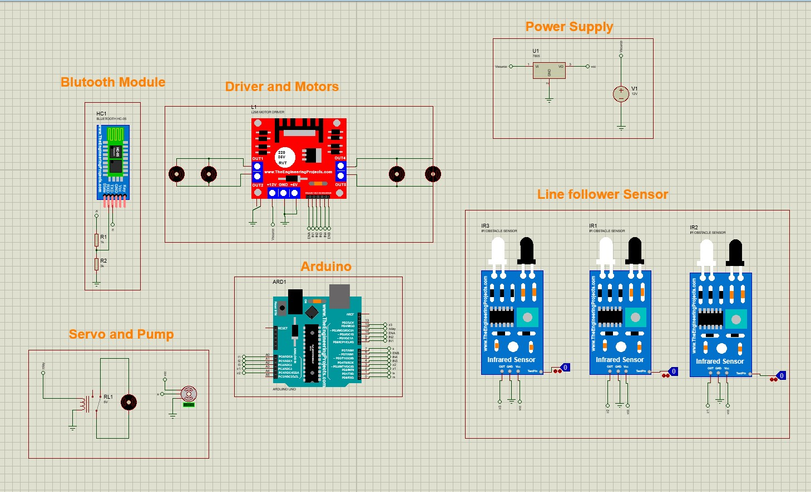
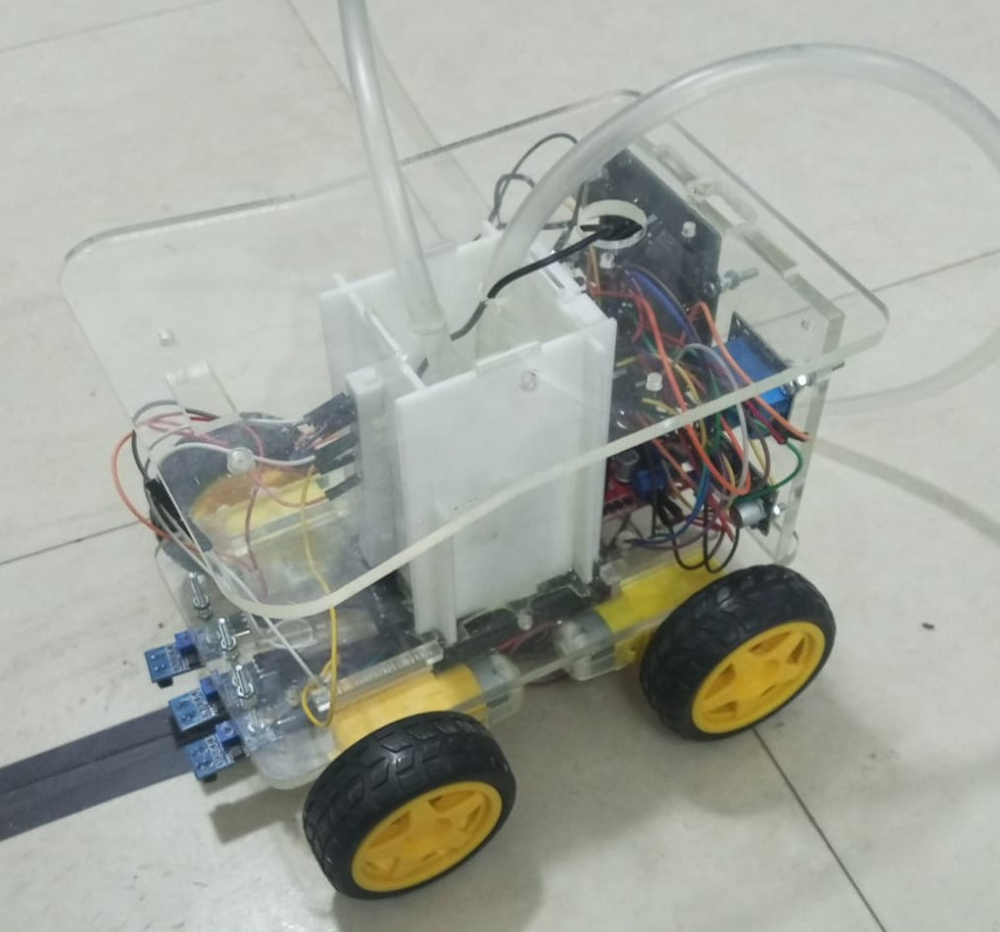

# Fire and Ash Competition Robot

This project contains the firmware and design assets for an autonomous and manually controlled firefighting robot. The robot is designed to navigate a track using line-following sensors and extinguish targets using an onboard water pump system.

---

## Project Overview

This system is engineered for dual-mode operation, allowing for automated navigation and manual tactical intervention. It utilizes a multi-sensor array for pathfinding and a dedicated pump mechanism for firefighting tasks.

### Core Features
* **Dual Operating Modes**: Supports seamless switching between Autonomous (Line Follower) and Manual (Bluetooth) control.
* **Directional Nozzle Control**: Includes a servo-mounted nozzle for precise water delivery.
* **Automated Line Navigation**: Employs a three-sensor IR array to maintain course and handle turns.
* **Voltage Monitoring**: Integrated Battery Management System (BMS) logic to track power levels.

---

## Technical Specifications

### Hardware Components
* **Microcontroller**: Arduino Uno
* **Motor Driver**: L298N Dual H-Bridge
* **Communication**: HC-05 Bluetooth Module
* **Actuators**: Submersible pump and high-torque steering servo

### Pin Configuration
| Component | Pin | Function |
| :--- | :--- | :--- |
| **L298N (IN1, IN2)** | 9, 10 | Left Motor Direction |
| **L298N (IN3, IN4)** | 11, 12 | Right Motor Direction |
| **ENA / ENB** | 5, 6 | Speed Control (PWM) |
| **IR Sensors** | A1, A2, A0 | Left, Center, Right Path Sensors |
| **Servo** | 3 | Nozzle Aiming Signal |
| **Pump** | 13 | Water Pump Control |
| **BMS** | A4 | Battery Voltage Sensing |

---

## Control Commands (Manual Mode)

When the robot is set to Manual Mode ('M'), it responds to the following inputs via Serial/Bluetooth:

| Command | Action |
| :--- | :--- |
| **9 / 2** | Move Forward / Move Backward |
| **4 / 6** | Turn Left / Turn Right |
| **5** | Stop All Motors |
| **W / S** | Adjust Nozzle Angle (Up/Down) |
| **P** | Activate Water Pump |
| **A / M** | Set Mode to Autonomous / Manual |

---

## Visual Documentation

### System Schematic

### Design and Build
| 3D Model | Final Assembly |
| :---: | :---: |
|  |  |

---

## Setup Instructions
1. Assemble the hardware components as detailed in the `Schematic.jpg`.
2. Open `Final_Code.ino` in the Arduino IDE.
3. Ensure the standard `Servo.h` library is available in your environment.
4. Upload the code to the Arduino Uno and initiate the Serial Monitor for Bluetooth pairing.
